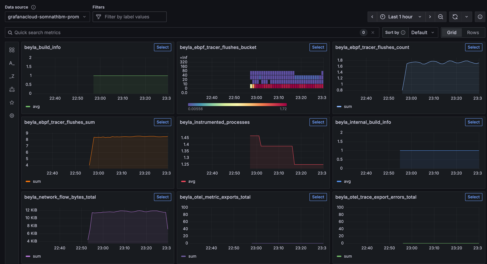
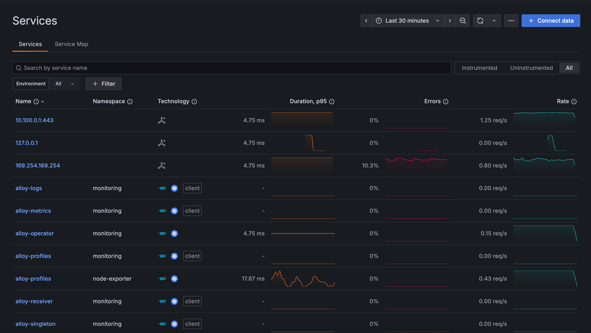
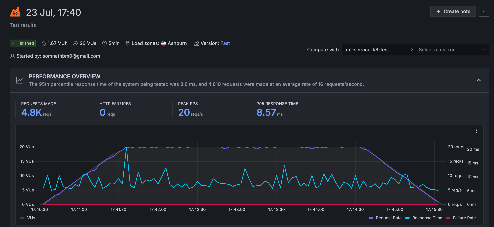
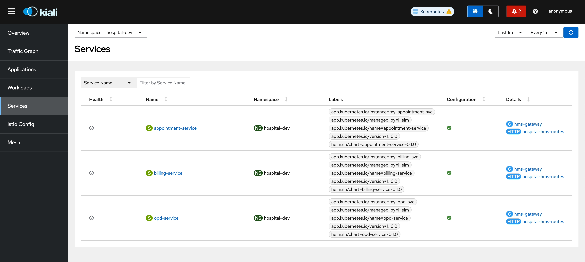

# hospital-hms-infra

Infra repo for the [hospital-hms repo](https://github.com/somnathbm/hospital-hms)

---

## Tools used:
  - Helm charts for each service
  - Kustomize for multi-stage config generation
  - ArgoCD app-of-apps style for GitOps deployment
  - Terraform / Cloudformation / CDK for IaC
  - LGTM (Loki-Grafana-Tempo-Mimir) stack for Observability
  - LitmusChaos for Chaos experiments
  - Cluster is hosted on EKS

---

## 📊 Screenshots of dashboard









---

## 📁 Infrastructure Monorepo Structure

```bash
hospital-hms-infra/
  .
├── argo-apps
│   ├── app-of-apps.yaml
│   ├── dev
│   │   ├── appointment-app.yaml
│   │   ├── billing-app.yaml
│   │   └── opd-app.yaml
│   ├── prod
│   │   ├── appointment-app.yaml
│   │   ├── billing-app.yaml
│   │   └── opd-app.yaml
│   └── test
│       ├── appointment-app.yaml
│       ├── billing-app.yaml
│       └── opd-app.yaml
├── charts
│   ├── appointment-service
│   │   ├── Chart.yaml
│   │   ├── templates
│   │   │   ├── _helpers.tpl
│   │   │   ├── deployment.yaml
│   │   │   └── service.yaml
│   │   └── values.yaml
│   ├── billing-service
│   │   ├── Chart.yaml
│   │   ├── templates
│   │   │   ├── _helpers.tpl
│   │   │   ├── deployment.yaml
│   │   │   └── service.yaml
│   │   └── values.yaml
│   └── opd-service
│       ├── Chart.yaml
│       ├── templates
│       │   ├── _helpers.tpl
│       │   ├── deployment.yaml
│       │   ├── NOTES.txt
│       │   └── service.yaml
│       └── values.yaml
├── cloudformation
│   └── infra.yaml
├── eksctl-cluster.yaml
├── overlays
│   ├── dev
│   │   ├── appointment-values.yaml
│   │   ├── billing-values.yaml
│   │   ├── kustomization.yaml
│   │   └── opd-values.yaml
│   ├── prod
│   │   ├── appointment-values.yaml
│   │   ├── billing-values.yaml
│   │   ├── kustomization.yaml
│   │   └── opd-values.yaml
│   └── test
│       ├── appointment-values.yaml
│       ├── billing-values.yaml
│       ├── kustomization.yaml
│       └── opd-values.yaml
├── README.md
└── terraform
    ├── eks.tf
    └── main.tf
```
---